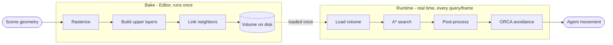
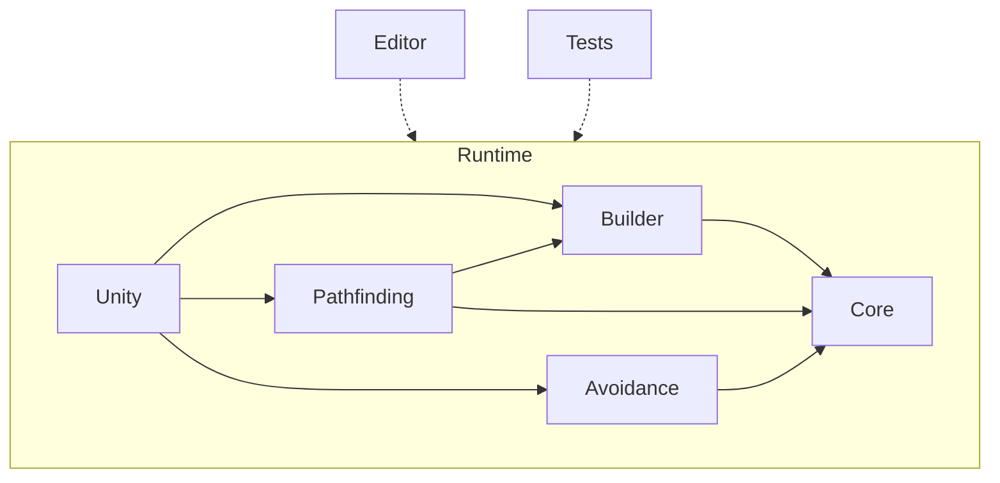
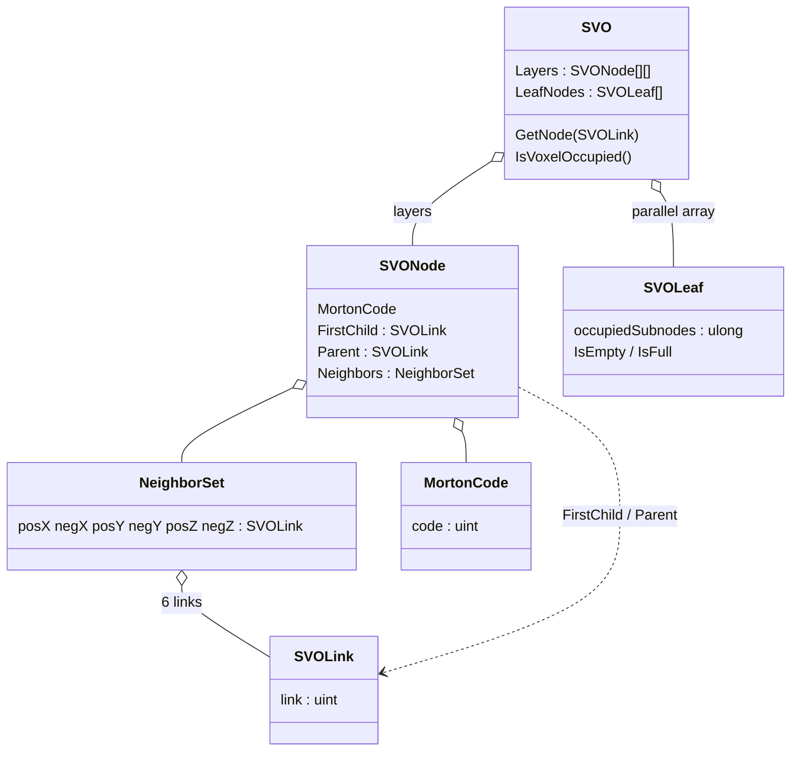
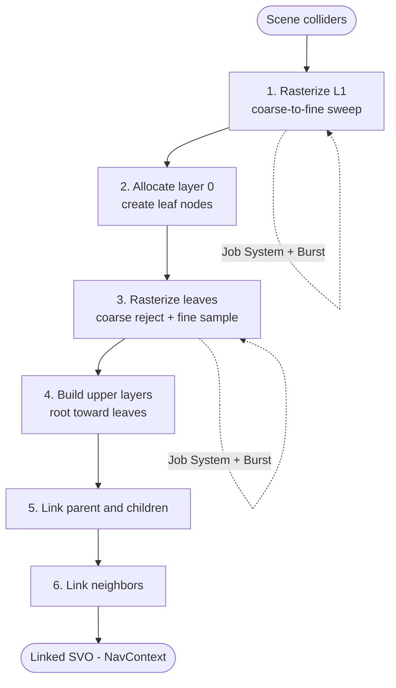
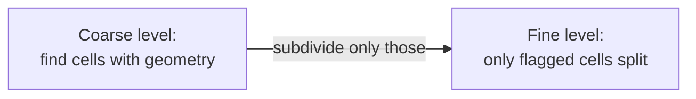
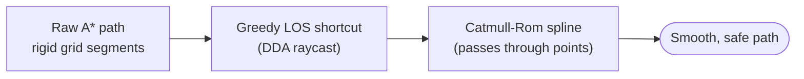
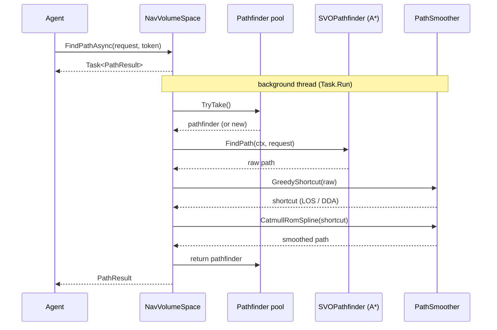
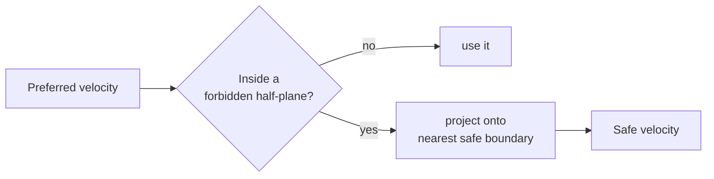

# System Basics

This document explains how NavVolume is put together and how the pieces fit, for developers who want to read or contribute to the code. It is not an API reference or a usage tutorial. It describes the architecture, the data structure that represents navigable space, and the three pipelines that do the real work: building the volume, searching and refining a path, and avoiding collisions at runtime.

If you only remember one thing, remember that NavVolume runs in **two phases**. A heavy **bake** phase turns scene geometry into a compact data structure and writes it to disk. A light **runtime** phase loads that structure and answers path queries and avoidance steps frame by frame. Almost every design decision follows from wanting the bake to absorb the cost so the runtime stays cheap.

## Module architecture

The code is split into three assemblies, which are C#'s units of compilation. Keeping them separate means the editor tooling and the test code never ship inside a game build.

- **Runtime** holds all the navigation logic and is the only assembly included in a final build.
- **Editor** holds the custom inspectors, gizmos and panels. It depends on Runtime, never the other way around.
- **Tests** holds the automated tests, split into EditMode and PlayMode suites.

Inside the Runtime assembly the code is organized by namespace, and the folder layout under [`Assets/NavVolume/Runtime`](Assets/NavVolume/Runtime) mirrors those namespaces one to one:

- `Core` ([Core/](Assets/NavVolume/Runtime/Core)) holds the fundamental data structures: the octree itself, its nodes and leaves, Morton codes and the compact links.
- `Builder` ([Builder/](Assets/NavVolume/Runtime/Builder)) builds the volume from scene geometry, including the Burst jobs and the bake profiler.
- `Pathfinding` ([Pathfinding/](Assets/NavVolume/Runtime/Pathfinding)) runs the search and the post-processing, plus the public request and result types under `Api`.
- `Avoidance` ([Avoidance/](Assets/NavVolume/Runtime/Avoidance)) runs the per-frame local avoidance, with the ORCA solver under `Orca` and the spatial structures under `Spatial`.
- `Unity` ([Unity/](Assets/NavVolume/Runtime/Unity)) is the glue to the engine: the `MonoBehaviour` components, the build modes and the scene hashing.

`Core` is the common foundation. `Builder`, `Pathfinding` and `Avoidance` all sit on top of it, and `Unity` orchestrates them and exposes the system to the engine.

Almost every type in Runtime is `internal`. The public surface a game programmer touches is small on purpose: the components `NavVolumeSpace`, `NavVolumeAgent` and `NavVolumeObstacle`. As a contributor you work mostly below that line, with the internal types.

The assembly definition files enforce the dependency directions above, so a stray `using` that points the wrong way will not compile. On top of that, continuous integration runs the Csharpier format check and the full test battery on every pull request, and a failure in either blocks the merge.

## How space is represented

NavVolume does not store a dense 3D grid of voxels. A flying agent spends most of its time in open air, so a dense grid would waste almost all of its memory on empty cells. Instead the navigable space is stored as a **Sparse Voxel Octree (SVO)**, an octree variant that only subdivides regions that actually contain geometry.

### Layers, nodes and leaves

The tree is stored as a set of **layers**, where each layer is a flat array of nodes sorted by Morton code (see [`SVO.cs`](Assets/NavVolume/Runtime/Core/SVO.cs)). Upper layers cover large chunks of space, lower layers add detail. The bottom layer is made of **leaves**, and a leaf is special: instead of having eight children it holds a dense 4x4x4 grid of voxels.

That leaf grid is encoded as a single 64-bit integer (a `ulong`). Each of the 64 voxels maps to one bit, where 1 means occupied and 0 means free (see [`SVOLeaf.cs`](Assets/NavVolume/Runtime/Core/SVOLeaf.cs)). A whole leaf is therefore 8 bytes, and you can ask whether it is completely empty or completely full with one numeric comparison instead of inspecting 64 voxels.

### Morton codes

To map a 3D coordinate to a position in those flat arrays, NavVolume uses **Morton codes**, which interleave the bits of the x, y and z coordinates into one integer (see [`MortonCode.cs`](Assets/NavVolume/Runtime/Core/MortonCode.cs)). Morton ordering keeps spatially close cells close in memory, which is good for the cache, and it makes hierarchy operations trivial: the parent of a code is just a right shift, a child is a left shift plus the octant bit. Because the codes use 32-bit integers, the maximum resolution is 1024 cells per axis.

Looking up a node in a layer is a binary search over the Morton-ordered array, which is fast precisely because the array is kept sorted.

### Compact links

References between nodes do not use normal C# object references. They use a **compact link**, a single 32-bit integer that encodes everything needed to find any node or voxel (see [`SVOLink.cs`](Assets/NavVolume/Runtime/Core/SVOLink.cs)). The top bit says whether the link points to a node or a voxel, the middle 25 bits are the offset inside a layer, and the bottom 6 bits are the layer level or the index inside a leaf. This is a technique borrowed from raytracing. It saves memory and, because the link is just an integer, it can be used directly as a key in the hash tables of the search. The struct implements `IEquatable` so those comparisons avoid boxing in the hot path.

## The build pipeline

Building the volume from scene geometry is called **rasterization**, and it is the most expensive thing the system does. It is organized as a pipeline of independent stages where each stage consumes what the previous one produced. The whole thing is orchestrated by [`SVOBuilder`](Assets/NavVolume/Runtime/Builder/SVOBuilder.cs), driven by a `BuildSettings` value and producing a `NavContext`.

### Sampling with physics queries

NavVolume never reads mesh triangles directly. It asks the physics engine whether a box overlaps any collider, using `OverlapBox` queries (see [`SVORasterizer.cs`](Assets/NavVolume/Runtime/Builder/SVORasterizer.cs)). Because the volume of queries is enormous, they are batched through `OverlapBoxCommand` and run on worker threads with the Job System and the Burst compiler. The jobs themselves live under [`Builder/Jobs`](Assets/NavVolume/Runtime/Builder/Jobs).

### Two optimizations that make the bake feasible

The first is a **coarse-to-fine** sweep. Rather than sampling the whole world at full resolution, the sweep starts near the root and only subdivides cells that contain geometry. Empty subtrees are discarded whole, early.

The second, and one of the most important for performance, is **empty-leaf rejection**. Resolving a leaf precisely would need 64 `OverlapBox` queries, one per voxel. But most leaves are empty air. So leaf rasterization runs in two passes. A coarse pass fires a single query covering the whole leaf. If that query hits nothing, the leaf is marked empty and the other 63 queries are skipped. Only the leaves that survive the coarse pass run the full 64-query fine pass, and a reduction job condenses the result into the 64-bit mask. Since leaves with obstacles are a minority, this cuts the number of physics queries by close to a factor of 64 across most of the volume.

### Agent radius

An agent is not a point, it has a body. To keep paths from clipping corners, the `OverlapBox` queries are expanded by the agent radius during sampling. Any voxel closer to geometry than the agent's size is automatically marked occupied, so any path the system later reports as free has the clearance the agent needs, by construction. This needs no extra stage, it is just a larger query box.

### Neighbor linking

A* needs to walk from a node to its six face neighbors, so after the leaves and upper layers exist, every node is linked to its neighbors in the +/-X, +/-Y and +/-Z directions (see [`SVONeighborLinker.cs`](Assets/NavVolume/Runtime/Builder/SVONeighborLinker.cs)). The tricky case is two regions meeting at different resolutions. NavVolume solves it by walking from the root toward the leaves and using **parent inheritance**: for a given node and direction it first looks for a same-size neighbor by Morton code, and if there is none, the node simply inherits the neighbor link of its larger parent instead of doing an exhaustive cross-size search.

### Serialization and integrity

Rebuilding the SVO every time a scene loads would be too slow, so the volume is baked in the editor and stored on disk inside a Unity asset. It is serialized as a **single flat binary blob** with no pointers (see [`NavVolumeBakedData.cs`](Assets/NavVolume/Runtime/Unity/NavVolumeBakedData.cs)). Each leaf is one 64-bit integer and each node is nine 32-bit integers, holding its Morton code, the links to its first child and parent, and its six neighbors. Loading is then a sequential read of the byte stream with no hierarchy to reconstruct.

To catch the case where the scene changed after the bake, the blob is accompanied by a **hash** of the relevant geometry, computed during the bake and compared on load (see [`Unity/Hashing`](Assets/NavVolume/Runtime/Unity/Hashing)). The hash uses FNV-1a rather than C#'s default hashing, which is not deterministic across runs. Because FNV-1a works byte by byte and transforms are stored as floats, the code reinterprets the exact bit pattern of each float through an explicit `[StructLayout]` union, and it sorts the colliders into a fixed order first so the hash does not depend on the order the engine happened to enumerate them.

## The runtime query: search, refinement and avoidance

At runtime the loaded volume answers two kinds of work. A path query produces a smoothed, collision-free trajectory between two points. A local avoidance step keeps moving agents from running into each other and into dynamic obstacles. The pathfinding part is itself a search followed by a refinement.

### Search: A* over a heterogeneous-resolution graph

The planner is a weighted A* adapted to run on the SVO (see [`SVOPathfinder.cs`](Assets/NavVolume/Runtime/Pathfinding/SVOPathfinder.cs)). What makes it different from a textbook grid A* is that the graph has **heterogeneous resolution**. A single hop can cross from a huge open-space node to a tiny voxel pressed against a wall. The search adapts how it expands a neighbor to its kind:

- A **free node** is crossed in one hop. This is what lets the search fly across large empty regions while touching very few nodes.
- A **node with geometry** cannot be crossed safely, so it is subdivided and its eight children are evaluated at finer resolution.
- A **partially occupied leaf** has its free voxels examined directly, ignoring the blocked ones.

The open list is a binary [`MinHeap`](Assets/NavVolume/Runtime/Pathfinding/MinHeap.cs), and the compact link doubles as the key into the dictionaries that track each node's accumulated cost and where it came from. The reconstruction walks those came-from links back from the goal, and it handles the edge cases: trivial scenes, start or goal inside an obstacle, and a node budget so an impossible query cannot hang the search.

Cost can be measured two ways (see [`SVOHeuristic.cs`](Assets/NavVolume/Runtime/Pathfinding/SVOHeuristic.cs)). **Euclidean distance** gives the geometrically shortest path. **Node count** charges 1 per hop regardless of node size, which makes the search prefer a few large nodes over many small ones and so steers agents toward open space and away from walls. The heuristic is straight-line distance to the goal times a configurable weight W, which trades optimality for speed. In node-count mode the heuristic is scaled by the largest node size so both terms of `f = g + W * h` stay on the same scale.

### Refinement: shortcut then smooth

A raw A* path looks artificial, a chain of rigid segments aligned to the grid. Post-processing fixes that in two passes, both designed so they can never introduce a collision because each only operates on points already proven free (see [`PathSmoother.cs`](Assets/NavVolume/Runtime/Pathfinding/PathSmoother.cs)).

First, a **greedy line-of-sight shortcut**, a variant of string pulling. Starting from the first point, it tries to draw a straight line to the farthest point it can still see, and if there is clear line of sight it drops all the nodes in between. The line-of-sight check is a 3D DDA traversal that steps voxel by voxel along the segment, always advancing along the axis whose next voxel boundary is closest, so it never skips or double-counts a voxel (see [`SVORaycast.cs`](Assets/NavVolume/Runtime/Pathfinding/SVORaycast.cs)).

Second, a **Catmull-Rom spline** smooths the shortcut path. This curve is chosen because it passes exactly through all of its control points. Since the shortcut already proved those points are in free space, forcing the curve through them keeps the smoothed result safe.

### Sync and async queries

A query can run two ways through [`NavVolumeSpace`](Assets/NavVolume/Runtime/Unity/Components/NavVolumeSpace.cs). The **synchronous** path reuses a single pathfinder instance on the main thread. The **asynchronous** path runs the search on a worker thread, draws a pathfinder from a pool to save allocations, and can be cancelled through a token. The async variant returns a `Task` immediately and does the search, the shortcut and the smoothing off the main thread before handing back the result.

### Avoidance: ORCA between agents

Pathfinding avoids static geometry but does nothing about agents running into each other. That is handled separately, every frame, by **ORCA** (Optimal Reciprocal Collision Avoidance), adapted from the RVO2-3D library (see [`Avoidance/Orca`](Assets/NavVolume/Runtime/Avoidance/Orca)). ORCA works in velocity space. Each nearby agent and each piece of geometry induces a half-plane of forbidden velocities, and the solver picks the feasible velocity closest to the agent's preferred one. If too many constraints make the problem infeasible, it relaxes them to minimize the impact of the collision rather than failing.

Because this runs for every agent every frame, it is built for throughput (see [`AvoidanceSimulation.cs`](Assets/NavVolume/Runtime/Avoidance/AvoidanceSimulation.cs) and [`AvoidanceJob.cs`](Assets/NavVolume/Runtime/Avoidance/AvoidanceJob.cs)):

- Each agent's avoidance is independent, so the work runs on the Job System with Burst.
- A **spatial hash** finds nearby agents without comparing every pair (see [`Avoidance/Spatial`](Assets/NavVolume/Runtime/Avoidance/Spatial)).
- The solver uses `stackalloc` and `Span<T>` for its temporaries, so it allocates nothing on the heap and adds no pressure on the garbage collector.
- The jobs are scheduled at the end of one frame and collected at the start of the next, so the simulation overlaps with rendering.

Avoidance also reads the occupied voxels of the nearby SVO, so the steering respects baked static geometry as well, not just other agents.

## Design choices worth knowing

A few decisions recur throughout the codebase and explain a lot of the surrounding code:

- **Compact representation.** Bitmask leaves and 32-bit links keep memory low and cache misses rare. A lot of the code manipulates bits directly for this reason.
- **Coarse-to-fine everywhere.** The same idea drives both the bake (skip empty regions early) and the search (big hops in open space, fine steps only near obstacles). When you see resolution being treated lazily, this is why.
- **Data-oriented runtime.** The hot paths reuse buffers, return `ref readonly` instead of copying structs, amortize cancellation checks, and avoid boxing. The goal is to keep per-query and per-frame heap allocations near zero.
- **Modularity enforced by the build.** The assembly definitions make the dependency directions a compile-time rule, not a convention, which is what lets each piece be tested in isolation.

## Where to start as a contributor

The public entry point is [`NavVolumeSpace`](Assets/NavVolume/Runtime/Unity/Components/NavVolumeSpace.cs), the component that owns a volume and exposes building, path queries and spatial queries such as `IsNavigable`, `TrySnapToNavigable` and the random-point samplers. From there, follow the namespace you care about: `Core` for the data structure, `Builder` for the bake, `Pathfinding` for the search and refinement, `Avoidance` for ORCA, `Unity` for the engine glue.

Tests live under `Assets/NavVolume/Tests`, split into EditMode and PlayMode. The structures that manipulate bits, such as Morton coding and the compact links, are covered with property-based round-trip tests. The bake and the paths are checked against the real physics engine in PlayMode. Run the suite before opening a pull request, since CI will run the same tests plus the Csharpier format check and block the merge if either fails. See [CONTRIBUTING.md](CONTRIBUTING.md) for the full setup and conventions.
